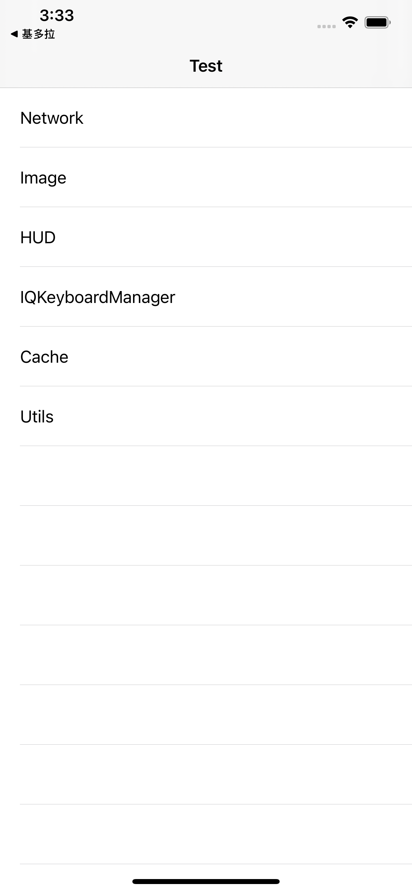

# Mothra
### 简介
把CocoaPods上底层功能模块库封装成基础模块中间层，便于模块化开发。

- ✅ HUD层，基于`PKHUD`。
- ✅ Category层，收集的Category方法。
- ✅ Log层，基于`XCGLogger`的Log打印与本地日志生成。
- ✅ 网络层，`Moya`
- ✅ 缓存层，`EasyStash`
- ✅ 图片处理，`Kingfisher` 
- ✅ 其他，`SnapKit`，`IQKeyboardManager`，`Hue`


### 安装要求

```Swift
iOS 11.0

pod 'Mothra', :git => 'ssh://git@192.168.16.172:7999/em/Mothra.git' // 配置在本地服务器
```

### 使用
#### 启动配置

```Swift
# Appdelegate.swift
import Mothra

launchSetup()
        molog.debug(NSSearchPathForDirectoriesInDomains(.libraryDirectory, .userDomainMask, true).last! as String)
```
#### Demo


